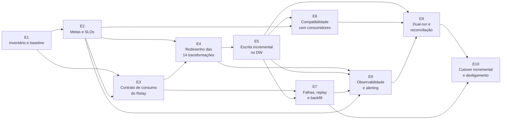

# Migrar Pipeline de Dados de Batch para Streaming

## Objetivo

Conduzir, por meio de uma cadeia de prompts Least-to-Most (1 prompt de decomposição + 10 prompts de execução, um por etapa), o planejamento detalhado da migração de um pipeline de dados de processamento em lote (cron + engine batch) para processamento contínuo em streaming — do inventário inicial ao cutover incremental e desligamento do batch.

## Quando usar

- Ao planejar a migração de um pipeline de ingestão/transformação de dados de batch para streaming, sem big-bang.
- Quando é preciso quebrar uma migração grande em etapas independentes e encadeadas, cada uma resolvida como um procedimento técnico executável — não "considerações gerais".
- Quando múltiplos sistemas downstream dependem do pipeline e precisam continuar funcionando durante toda a transição.
- Em contextos didáticos, para demonstrar a técnica Least-to-Most aplicada a uma migração de arquitetura de dados real.

## Exemplo de uso

Como operar a cadeia (adaptado da Seção 1 do material original):

1. Preencher a tabela de parâmetros uma única vez (os valores-padrão já vêm preenchidos com o cenário fictício da Aegis/Forge — ajustar o que mudar).
2. Colar o Bloco de Contexto Base no início de todo prompt da cadeia — ele é sempre o mesmo.
3. Rodar o Prompt 0 (decomposição) e guardar a resposta como a lista oficial de etapas.
4. Rodar os Prompts 1 a 10, um de cada vez, na ordem.
5. Antes de rodar o prompt de uma etapa, colar junto as respostas das etapas das quais ela depende — sem isso a resposta sai genérica.
6. Guardar cada resposta em um arquivo próprio (ex.: `E04-transformacoes.md`); elas viram insumo dos prompts seguintes.

Grafo de dependências entre as etapas:

Checklist de execução:

- [ ] Parâmetros preenchidos
- [ ] Prompt 0 rodado e decomposição aprovada pelo time
- [ ] E1 Inventário e baseline
- [ ] E2 Metas, SLOs e critérios de equivalência
- [ ] E3 Contrato de consumo do Relay
- [ ] E4 Redesenho das transformações
- [ ] E5 Escrita incremental no DW
- [ ] E6 Camada de compatibilidade
- [ ] E7 Falhas, replay e backfill
- [ ] E8 Observabilidade e alerting
- [ ] E9 Dual-run e reconciliação
- [ ] E10 Cutover incremental e desligamento do batch

## Limitações conhecidas

Cadeia manual: é preciso rodar um prompt por vez, colar as respostas das etapas dependentes antes de cada novo prompt e guardar cada resposta em arquivo próprio — sem isso, segundo o próprio material, a resposta "sai genérica". Os valores-padrão da tabela de parâmetros já assumem o cenário fictício da Aegis/Forge (Relay, Forge, Sentinel, Cerebro); usos fora desse cenário exigem substituir todos os `{{...}}` pelos dados reais.
